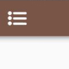

## Как использовать? 

Алгоритм действий для покупателя работает по системе:
* Пришёл в заведение 
* Сделал заказ
* Показал qr код в приложении на кассе 
* Получил печать в карточку 
* Повторил эту процедуру несколько раз и получил бонус установленный продавцом. 

Для того что бы открыть QR код нажмите на элемент в верхнем левом углу экрана. 

Откроется сайдбар внизу которого будет QR код, вы можете нажать на него что бы увеличить. 

После получения карты вы можете посмотреть дополнительную информацию о карте нажав на неё.
