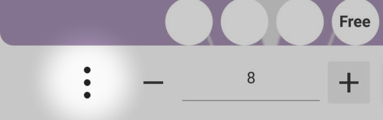

# Guide to using Cheat Cards for merchants

In this section you can find information about using the Cheat card.

## How to use?

To implement the loyalty program of your institution using a cheat card, you need to do the following:

### Create a card for your establishment

* In order to create a map, click the "Add Map" button at the bottom of the screen.

* An empty card will be created

* In order to fill it out, click the "Edit" button on the card.

* Enter the contact and other details of your establishment. In the item "Bonus name" it is necessary to indicate what the client will receive in the form of a bonus (product / service / discount / etc.).

* Indicate how many purchases the client must make to receive the bonus you previously specified.

* Customize the design of the card by clicking on this element at the bottom left of the card.

* A menu with design settings (background and text colors, logo, as well as printing) will open

* Optionally upload your logo or card print background design by clicking the add button in the appropriate sections.

* After completing all the settings, click the "Save" button which is located at the bottom of the map.

IMPORTANT: After you put at least one seal on the customer, the card cannot be edited. Instead, you can create a new map based on the old one. all customer data and their statistics will be automatically transferred to the corrected card. Instead, you can create a new map based on the old one. all customer data and their statistics will be automatically transferred to the corrected card.

### Issue a card to a client

* The created map will be displayed on the main screen of the application.

* In order to issue the card to the client, press and hold on it.

* A screen will open where you can specify how many stamps to put to the client, then click "print".

* Scan the visitor's QR code.

* The client will have a card with the number of stamps that you specified.

* Repeat this algorithm in order to put in the future seals to the client when purchasing a product.

### Issue bonus

* When the client has collected a sufficient number of stamps, you can give him a bonus, the application itself will notify you that the client has made a sufficient number of purchases.

* On the bonus screen, you can click the "Issue" button, or if the client can ask to save this bonus, then just click the back button.

* Bonuses can be accumulated by the client, if the client has accumulated several bonuses, then on the issuance screen you can choose how many bonuses to issue, after which they will be written off from the category of available ones and will be transferred to the category received on the client's card.
